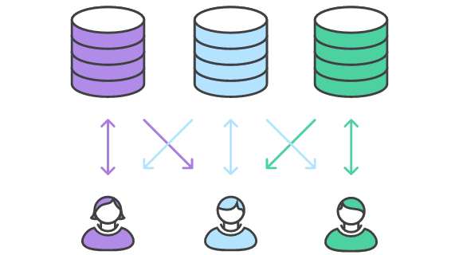
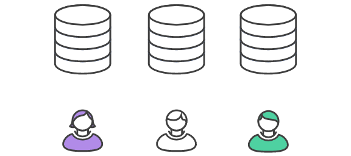
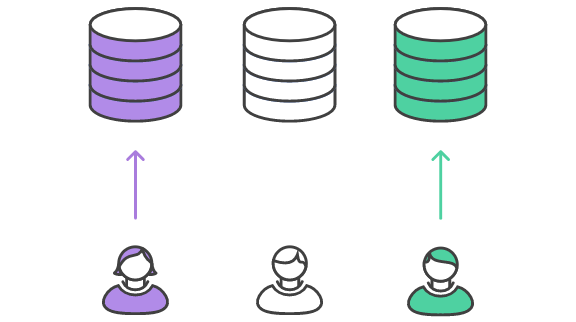
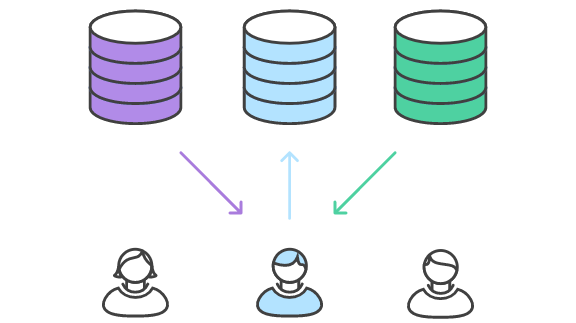
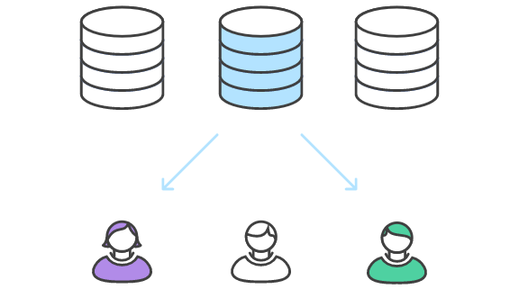

_Note: At LiveBy, we use git for source code management with the Forking Workflow, with collaboration happening on GitHub. The Forking Workflow is essentially the Feature Branch workflow with changes being pushed to individual developer repos, then merged into the main code base with Pull Requests._

[Forking Workflow](https://www.atlassian.com/git/tutorials/comparing-workflows/forking-workflow)

---
Forking Workflow
================



The Forking Workflow is fundamentally different than the other workflows discussed in this tutorial. Instead of using a single server-side repository to act as the “central” codebase, it gives every developer a server-side repository. This means that each contributor has not one, but two Git repositories: a private local one and a public server-side one.

The main advantage of the Forking Workflow is that contributions can be integrated without the need for everybody to push to a single central repository. Developers push to their own server-side repositories, and only the project maintainer can push to the official repository. This allows the maintainer to accept commits from any developer without giving them write access to the official codebase.

The result is a distributed workflow that provides a flexible way for large, organic teams (including untrusted third-parties) to collaborate securely. This also makes it an ideal workflow for open source projects.

## How It Works

As in the other Git workflows, the Forking Workflow begins with an official public repository stored on a server. But when a new developer wants to start working on the project, they do not directly clone the official repository.

Instead, they the official repository to create a copy of it on the server. This new copy serves as their personal public repository—no other developers are allowed to push to it, but they can pull changes from it (we’ll see why this is important in a moment). After they have created their server-side copy, the developer performs a [git clone](https://www.atlassian.com/git/tutorials/setting-up-a-repository/git-clone) to get a copy of it onto their local machine. This serves as their private development environment, just like in the other workflows.

When they're ready to publish a local commit, they push the commit to their own public repository—not the official one. Then, they file a pull request with the main repository, which lets the project maintainer know that an update is ready to be integrated. The pull request also serves as a convenient discussion thread if there are issues with the contributed code.

To integrate the feature into the official codebase, the maintainer pulls the contributor’s changes into their local repository, checks to make sure it doesn’t break the project, [merges it into his local master branch](https://www.atlassian.com/git/tutorials/using-branches/git-merge), then [pushes](https://www.atlassian.com/git/tutorials/syncing/git-push) master branch to the official repository on the server. The contribution is now part of the project, and other developers should pull from the official repository to synchronize their local repositories.

### The Official Repository

It’s important to understand that the notion of an “official” repository in the Forking Workflow is merely a convention. From a technical standpoint, Git doesn’t see any difference between each developer’s public repository and the official one. In fact, the only thing that makes the official repository so official is that it’s the public repository of the project maintainer.

### Branching in the Forking Workflow

All of these personal public repositories are really just a convenient way to share branches with other developers. Everybody should still be using branches to isolate individual features, just like in the [Feature Branch Workflow](https://www.atlassian.com/git/tutorials/comparing-workflows/feature-branch-workflow) and the [Gitflow Workflow](https://www.atlassian.com/git/tutorials/comparing-workflows/gitflow-workflow). The only difference is how those branches get shared. In the Forking Workflow, they are pulled into another developer’s local repository, while in the Feature Branch and Gitflow Workflows they are pushed to the official repository.

## Example

__The project maintainer initializes the official repository__


As with any Git-based project, the first step is to create an official repository on a server accessible to all of the team members. Typically, this repository will also serve as the public repository of the project maintainer.

[Public repositories should always be bare](https://www.atlassian.com/git/tutorials/setting-up-a-repository/git-init), regardless of whether they represent the official codebase or not. So, the project maintainer should run something like the following to set up the official repository:

```
ssh user@host
git init --bare /path/to/repo.git
```

Bitbucket also provides a convenient GUI alternative to the above commands. This is the exact same process as setting up a central repository for the other workflows in this tutorial. The maintainer should also push the existing codebase to this repository, if necessary.

### Developers fork the official repository


Next, all of the other developers need to fork this official repository. It’s possible to do this by ’ing into the server and running git clone to copy it to another location on the server—yes, forking is basically just a server-side clone. But again, Bitbucket let developers fork a repository with the click of a button.

After this step, every developer should have their own server-side repository. Like the official repository, all of these should be bare repositories.

### Developers clone their forked repositories


Next each developer needs to clone their own public repository. They can do with the familiar git clone command

Our example assumes the use of Bitbucket to host these repositories. Remember, in this situation, each developer should have their own Bitbucket account and they should clone their server-side repository using:

```
git clone https://user@bitbucket.org/user/repo.git
```

Whereas the other workflows in this tutorial use a single origin remote that points to the central repository, the Forking Workflow requires two remotes—one for the official repository, and one for the developer’s personal server-side repository. While you can call these remotes anything you want, a common convention is to use origin as the remote for your forked repository (this will be created automatically when you run git ```clone upstream``` for the official repository.

```
git remote add upstream https://bitbucket.org/maintainer/repo
```

You’ll need to create the upstream remote yourself using the above command. This will let you easily keep your local repository up-to-date as the official project progresses. Note that if your upstream repository has authentication enabled (i.e., it‘s not open source), you’ll need to supply a username, like so:

```
git remote add upstream https://user@bitbucket.org/maintainer/repo.git
```

This requires users to supply a valid password before cloning or pulling from the official codebase.

### Developers work on their features



In the local repositories that they just cloned, developers can edit code, [commit changes create branches](https://www.atlassian.com/git/tutorials/saving-changes/git-commit) just like they did in the other workflows:

```
git checkout -b some-feature
# Edit some code
git commit -a -m "Add first draft of some feature"
```

All of their changes will be entirely private until they push it to their public repository. And, if the official project has moved forward, they can access new commits with [git pull](https://www.atlassian.com/git/tutorials/syncing/git-pull)

```
git pull upstream master
```

Since developers should be working in a dedicated feature branch, this should generally [result in a fast-forward merge](https://www.atlassian.com/git/tutorials/using-branches/git-merge)

### Developers publish their features



Once a developer is ready to share their new feature, they need to do two things. First, they have to make their contribution accessible to other developers by pushing it to their public repository. Their ```origin``` remote should already be set up, so all they should have to do is the following:

```
git push origin feature-branch
```

This diverges from the other workflows in that the ```origin``` remote points to the developer’s personal server-side repository, not the main codebase.

Second, they need to notify the project maintainer that they want to merge their feature into the official codebase. Bitbucket provides a “[Pull request](https://confluence.atlassian.com/display/STASH/Using+pull+requests+in+Stash)” button that leads to a form asking you to specify which branch you want to merge into the official repository. Typically, you’ll want to integrate your feature branch into the upstream remote’s master branch.

### The project maintainer integrates their features



When the project maintainer receives the pull request, their job is to decide whether or not to integrate it into the official codebase. They can do this in one of two ways:

1. Inspect the code directly in the pull request

2. Pull the code into their local repository and manually merge it

The first option is simpler, as it lets the maintainer view a diff of the changes, comment on it, and perform the merge via a graphical user interface. However, the second option is necessary if the pull request results in a merge conflict. In this case, the maintainer needs to [fetch](https://www.atlassian.com/git/tutorials/syncing/git-fetch) the feature branch from the developer’s server-side repository, merge it into their local master branch, and resolve any conflicts:

```
git fetch https://bitbucket.org/user/repo feature-branch
# Inspect the changes
git checkout master
git merge FETCH_HEAD
```

Once the changes are integrated into their local master, the maintainer needs to push it to the official repository on the server so that other developers can access it:

```
git push origin master
```

Remember that the maintainer's ```origin``` points to their public repository, which also serves as the official codebase for the project. The developer's contribution is now fully integrated into the project.

### Developers synchronize with the official repository



Since the main codebase has moved forward, other developers should synchronize with the official repository:

```
git pull upstream master
```

## Where To Go From Here

If you’re coming from an SVN background, the Forking Workflow may seem like a radical paradigm shift. But don’t be afraid—all it’s really doing is introducing another level of abstraction on top of the [Feature Branch Workflow](https://www.atlassian.com/git/tutorials/comparing-workflows/feature-branch-workflow). Instead of sharing branches directly though a single central repository, contributions are published to a server-side repository dedicated to the originating developer.

This article explained how a contribution flows from one developer into the official master branch, but the same methodology can be used to integrate a contribution into any repository. For example, if one part of your team is collaborating on a particular feature, they can share changes amongst themselves in the exact same manner—without touching the main repository.

This makes the Forking Workflow a very powerful tool for loosely-knit teams. Any developer can easily share changes with any other developer, and any branch can be efficiently merged into the official codebase.
